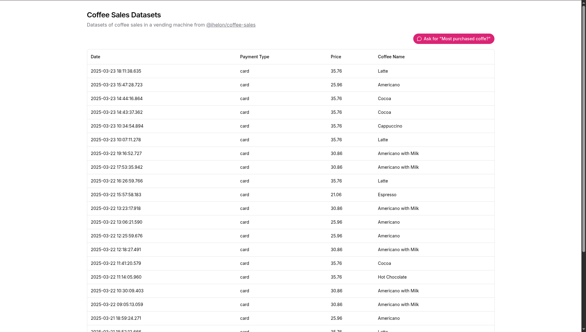

# Chat DB - A simple Gemini text-to-SQL app with human-friendly response

This is a final project for Maju Bareng AI with Hacktiv8: AI for Data Scientist.

## Run locally

### Web

0. Install dependencies

```sh
cd web && bun install
```

1. Run

```sh
bun dev
```

### Api

0. Make sure you have Docker and `docker-compose` installed.
1. Run

```sh
docker-compose up -d
```

## Gallery




